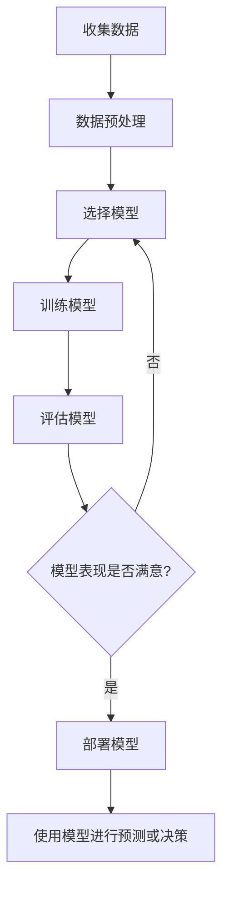

# machine-learning

# 机器学习的主要任务

## 分类任务

1. 二分类
   - 判断邮件是否是垃圾邮件
   - 肿瘤是良性还是恶性
2. 多分类
   - 数字识别
   - 图像识别
   - 期末考试等级
3. 多标签分类

## 回归任务

结果是一个连续数字的值，而非一个类别，比如房屋价格走势、买卖商品利润预测、股票价格

```mermaid
graph TD
    A[收集数据] --> B[数据预处理]
    B --> C[选择模型]
    C --> D[训练模型]
    D --> E[评估模型]
    E --> F{模型表现是否满意?}
    F -->|是| G[部署模型]
    F -->|否| C
    G --> H[使用模型进行预测或决策]
```
