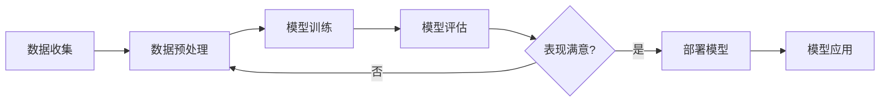

# machine-learning

# 机器学习的主要任务

## 分类任务

1. 二分类
   - 判断邮件是否是垃圾邮件
   - 肿瘤是良性还是恶性
2. 多分类
   - 数字识别
   - 图像识别
   - 期末考试等级
3. 多标签分类

## 回归任务

结果是一个连续数字的值，而非一个类别，比如房屋价格走势、买卖商品利润预测、股票价格

# 机器学习方法分类

- 监督学习
    - 解释：给机器的训练数据带有“标记”或者“答案“
    - k近邻
    - 线性回归和多项式回归
    - 逻辑回归
    - SVM
    - 决策树和随机森林
- 非监督学习
    - 对没有标记的数据进行分类-聚类分析，比如电商平台对初始用户群分类
- 半监督学习
    - 一部分数据有标记，另一部分数据没有
- 增强学习
