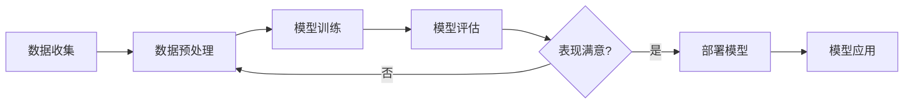

# machine-learning

# 机器学习的主要任务

## 分类任务

1. 二分类
   - 判断邮件是否是垃圾邮件
   - 肿瘤是良性还是恶性
2. 多分类
   - 数字识别
   - 图像识别
   - 期末考试等级
3. 多标签分类

## 回归任务

结果是一个连续数字的值，而非一个类别，比如房屋价格走势、买卖商品利润预测、股票价格



# 机器学习方法分类

- 监督学习
    - 解释：给机器的训练数据带有“标记”或者“答案“
    - k近邻
    - 线性回归和多项式回归
    - 逻辑回归
    - SVM
    - 决策树和随机森林
- 非监督学习
    - 对没有标记的数据进行分类-聚类分析，比如电商平台对初始用户群分类
- 半监督学习
    - 一部分数据有标记，另一部分数据没有
- 增强学习

# KNN
KNN是一种基础的机器学习算法，属于监督学习类别。它的核心思想是：物以类聚，通过分析新数据点周围最近的K个样本的类别来预测该数据点的类别

同时k近邻算法是非常特殊的，可以被认为是没有模型的算法。为了和其他算法统一，可以认为训练数据集就是模型本身
## 自定义模型
预测良性肿瘤和恶性肿瘤模型，数据集X和特征集Y，
```python
# X的数据为5行2列的矩阵
import numpy as np
import matplotlib.pyplot as plt
X = np.array([[6.745401,6.507143],[7.319939,5.986585],[1.560186,1.559945],[0.580836,3.661761],[1.011150,4.080726]])

# 特征集Y是5行1列的矩阵
Y = np.array([0,0,1,1,1])

plt.scatter(X[Y==0,0], X[Y==0,1], color='g')
plt.scatter(X[Y==1,0], X[Y==1,1], color='r')
plt.show()
```


接着不妨事先有个大概，比如一个新的点是(2,3)

```python
x = np.array([2,3]) # 待预测的肿瘤
plt.scatter(x[0],x[1],color='b') # 在图中的位置
```


第二步，计算距离

$$平面之间两点的间距公式：d = \sqrt{(x_2 - x_1)^2 + (y_2 - y_1)^2}$$

接着要计算待预测的点A距离其他5个点的间距分别是多少
1. 点1的横坐标 - 点A的横坐标
2. 点1的纵坐标 - 点A的纵坐标
3. 平方相加
4. 开根号
5. 重复，得到一个矩阵
用numpy的方式就可以简化成先把数据集X 减去 点A（矩阵相减），在平方开方运算：

```python
from math import sqrt
distances = [] # 定义一个空列表
for x_train in X: # x_train是一个1行2列的矩阵
    temp = x_train - x # 同形状的矩阵相减，得到横坐标和纵坐标的距离矩阵
    temp_square = temp ** 2 # 将距离矩阵平方
    d_square = np.sum(temp_square) # 求和，得到两点间距的平方和
    d = sqrt(d_square) # 开方，得到两点的距离
    distances.append(d)
```

最后得到distances矩阵：[5.900752720903495, 6.100937708741665, 1.5057206771579514, 1.56587166779944, 1.4648525555754752]

最后业务处理，我们得到了distances即每个点距离待处理点的间距数值，接下来排个序

```python
nearest = np.argsort(distances)
# 输出：[4 2 3 0 1]

k = 3 # 业务需求，即距离待处理点最近的3个点
topK_y = [Y[i] for i in nearest[:k]] # 得到距离待处理点最近的3个点是不是肿瘤
```

对于人类来说很好观察，但是对于机器不知道这三个点中，是否癌症的票数多少

```python
from collections import Counter
votes = Counter(topK_y) # 得到Counter({0:0, 1:3})
votes.most_common(1) # 得到票数最高的一个
```

**使用sklearn的KNN**

```python
from sklearn.neighbors import KNeighborsClassifier
kNN_classifier = KNeighborsClassifier(n_neighbors=3) # 用默认构造来创建一个对象
kNN_classifier.fit(X, Y) # 拟合
kNN_classifier.predict(x) # 预测待处理点x
```
